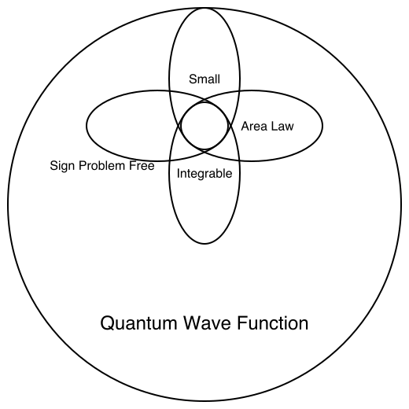

# Road to become a numeric gangster

---

## Goal

1. Implement an algorithm
2. Simulate a many-body system
3. Write a report

---

## Three models in the mind

- NP-complete model: Hard-core lattice gas (Classical part of Rydberg atoms array)
    $$
    H = - \sum_i Δ_i n_{r_i} + \sum_{i<j}V_{ij} n_{r_i} n_{r_j}
    $$
- Stoquastic model: Transverse field Ising model (2-level model of Rydberg atoms array)
    $$
    H = \sum_i \frac{\Omega_i}{2} \left(e^{i\phi_i}\ket{r_i}\bra{g_i} + e^{-i\phi_i}\ket{g_i}\bra{r_i}\right) - \sum_i Δ_i n_{r_i} + \sum_{i<j}V_{ij} n_{r_i} n_{r_j}
    $$

---

## QMA complete model: 3-level model of Rydberg atoms array

$$
\begin{aligned} 
    H = & \sum\_i \frac{\Omega\_i\^{\mathrm{hf}}(t)}{2}\left(e^{i \phi\_i^{\mathrm{hf}}(t)}|0\_i\rangle\langle 1\_i|+e\^{-i \phi\_i\^{\mathrm{hf}}(t)}| 1\_i\rangle\langle 0_i|\right)-\sum_i \Delta_i\^{\mathrm{hf}}(t)|1_i\rangle\langle 1_i| \\\\
    & +\sum_i \frac{\Omega\_i^{\mathrm{r}}(t)}{2}\\left\(e\^{i \\phi\_i^{\mathrm{r}}(t)}|1\_i\rangle\langle r\_i|+e^{-i \phi\_i^{\mathrm{r}}(t)}| r\_i\rangle\langle 1\_i|\right\)-\sum_i\left\[\Delta\_i\^{\mathrm{hf}}(t)+\Delta\_i^{\mathrm{r}}(t)\right\]\left\|r\_i\right\rangle\left\langle r\_i\right\| \\\\
    & +\sum_{i<j} V_{i j}\left|r_i\right\rangle\left\langle r_i|\otimes| r_j\right\rangle\left\langle r_j\right| .
\end{aligned}
$$

---

## How many methods can we use to solve this model?
- Exact diagonalization
- Tensor network method
- Monte carlo

---

## How to communicate?

- Onsite: 9:30AM-9:30PM, location TBA.
- Online: Zulip stream (less formal): `#NumericTrainingCamp`, for general discussion, sharing.
- Discussion room: 4th/5th floor, maker space

---

## Basic Rules

NOTE: I should go through the README.

Repo: [https://code.hkust-gz.edu.cn/numericgangsters/numerictrainingcamp](https://code.hkust-gz.edu.cn/numericgangsters/numerictrainingcamp)

---

## Preliminary

You must go through the following guides before starting a topic

- [Git and Pull request](https://book.jinguo-group.science/stable/chap1/git/)
- [VSCode + Markdown + Copilot for technical writing](guides/report-writing.md)
- [Using Google Scholar to conduct a survey](guides/conduct-survey.md)

---

## Goals for today

- I will introduce many-body computing and the four topics.
- Students decide the topic and the group before 2PM.

---

## Many-body computing

---

## Julia community

- https://julialang.org/community/

Note: I will go through several Julia Slack/Zulip channels, discourse

---

## Road Map

---

# Video watching: with questions in mind

TODO:
- A video about tensor networks
- A video about VMC

---

## Continue

- Reproduce a paper
- Work on a new idea

---

## Grouping

Before 2PM, students decide the topic and the group.

- 4 groups are formed.
- 2-4 students per group.

---

## About Projects: Pivot the Idea!
The provided topics may not be perfect for the following reasons:
- Has been done before.
- Too hard or too easy.
- Incorrect.

We need to do survey, discuss, discuss, and discuss to pivot the idea.
