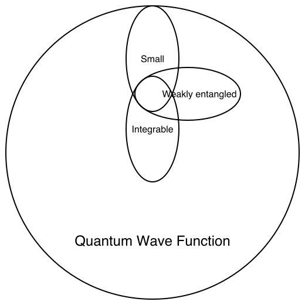

# Road to become a numeric gangster

---

## How it works

Repo: [https://github.com/CodingThrust/NumericTrainingCamp](https://github.com/CodingThrust/NumericTrainingCamp)

---

## Imagine: How can others help you?

{width=30%}

---

## Ask the right question

---

## Goals for today

- I will introduce many-body computational methods and the projects.
- Students will choose a project to work on.
- Students set up the environment.

---

## Many-body systems

We start from a Hamiltonian $H$ and solve the following problems:

1. Ground state
2. Thermal equilibrium
3. Time evolution

Or without a Hamiltonian, we simulate a quantum circuit.

---

## Complexity classification

Cubitt, T., Montanaro, A., 2016. Complexity Classification of Local Hamiltonian Problems. SIAM J. Comput. 45, 268–316. https://doi.org/10.1137/140998287

---

## NP-complete model

Let $G = (V, E)$ be a graph. The transverse field Ising mdoel (e.g. Rydberg atoms array without Rabi pulse) is NP-complete.
$$
H = - \sum_{i \in V} Δ_i n_{r_i} + \sum_{(i, j) \in E}V_{ij} n_{r_i} n_{r_j}
$$

*Unlikely to have a polynomial-time algorithm.*

---

## Stoquastic models
Transverse field Ising model (e.g. 2-level model of Rydberg atoms array)
$$
H = -J \sum_{(i, j) \in E} Z_i Z_j - h \sum_{j\in V} X_j
$$

*Absence of sign problem in quantum Monte Carlo simulations.*

---

## QMA complete model

Heisenberg model and 3-level model of Rydberg atoms array

$$
H = \sum_{(i, j) \in E} J_{ij}\mathbf{S}_i \cdot \mathbf{S}_j
$$

Ref: [3-level model of Rydberg atoms array](https://queracomputing.github.io/Bloqade.jl/dev/3-level/)

*Their low energy subspace can simulate any other quantum system.*

---

## Notes

The complexity classification is for the hardest problem in the class.

---

## Exactly solvable models

---

## Continue

- Go through the provided topics (in the [README](../README.md)).
- Students decide which project to work on before 2PM. Students choosing the same project will form a group.
  - Projects are mainly about how to reproduce the results of a paper.
  - Feel free to add new projects to the pool.
- Goal: Each group submit a link to a GitHub repository with the team name, project name and the group members' names.
